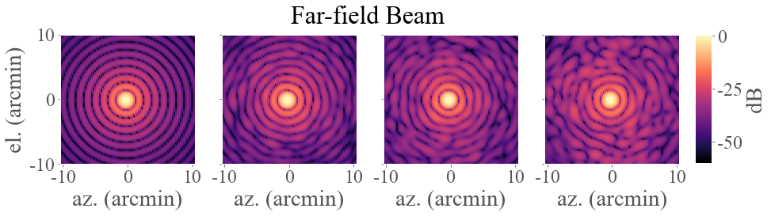

[](https://github.com/psf/black)
# holosim-ml 📡
```holosim-ml``` is a library for beam simulation and analysis of radio holography data from complex optical systems. This code uses machine learning to efficiently determine the position of hundreds of mirror adjusters on multiple mirrors with few micron accuracy. We apply this approach to the example of the Simons Observatory 6 m telescope.

<p align="center">
  
</p>

## Dependencies
* Python>=3.6
* numpy, scipy, matplotlib, sklearn

## Installation
```
$ git clone https://github.com/orgs/McMahonCosmologyGroup/holosim-ml
```

The notebooks call two .csv files with the telescope mirrors' panel geometries.  In order to run the notebooks, change the path in ```pan_mod.py``` to the location of the .csv files (lines 264 and 270). 
```
# Primary mirror adjuster positions
df_m1 = pd.read_csv(
    "path/to/folder/pans-adjs/Mirror-M1-vertical-adjuster-points_r1-1.csv",
    skiprows=2,
    na_values=["<-- ", "--> ", "<--", "-->"],
)
# Secondary mirror adjuster positions
df_m2 = pd.read_csv(
    "path/to/folder/pans-adjs/Mirror-M2-vertical-adjuster-points_r1-1.csv",
    skiprows=2,
    na_values=["<-- ", "--> ", "<--", "-->"],
)
```

## Contributions
If you have write access to this repository, please:
* create a new branch
* push your changes to that branch
* merge or rebase to get in sync with main
* submit a pull request on github
* If you do not have write access, create a fork of this repository and proceed as described above. For more details, see Contributing.

## 
Email: chesmore@uchicago.edu for .sav files.